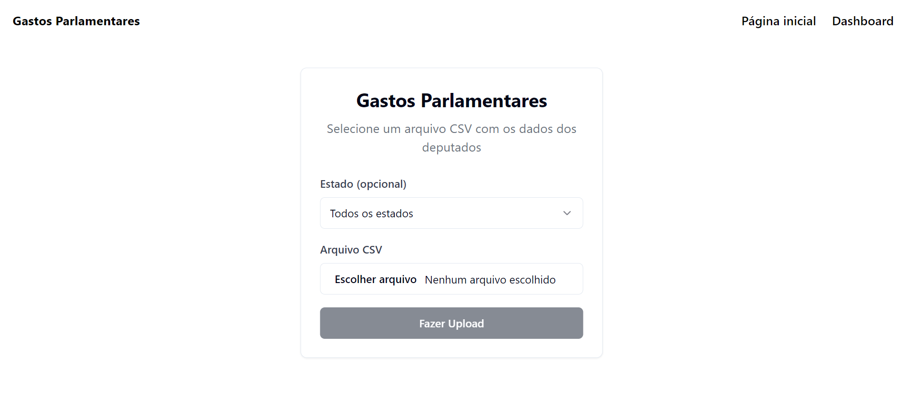
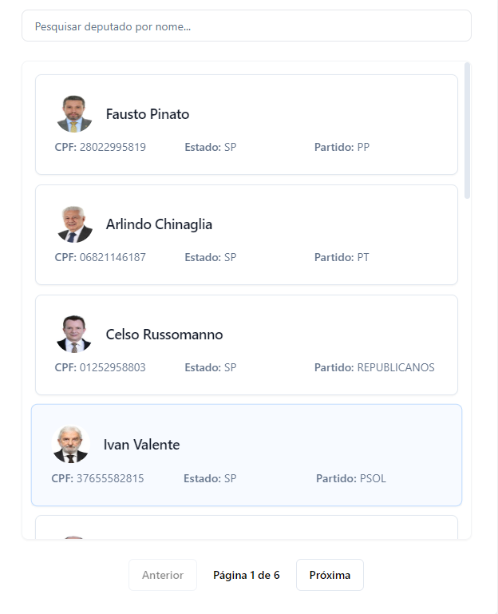
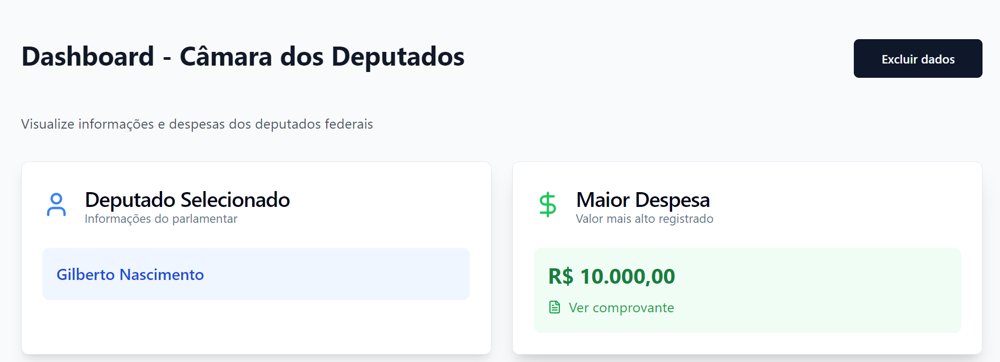
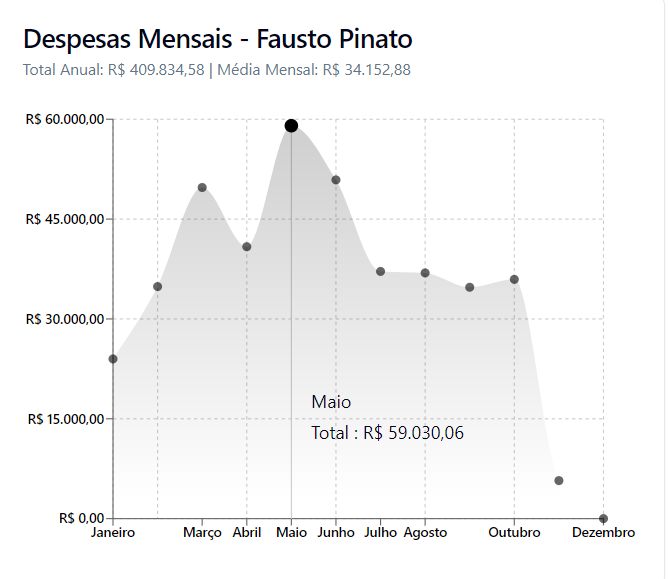

# Gastos Parlamentares

       [](https://www.linkedin.com/in/gabrieudev) 

Seja bem-vindo(a) ao meu projeto de dashboard para consulta de **Gastos Parlamentares**.

## Tabela de Conteúdos

- [Introdução](#introdução)
- [Funcionalidades](#funcionalidades)
- [Tecnologias](#tecnologias)
- [Iniciando](#iniciando)
- [Contribuições](#contribuições)
- [Contato](#contato)

## Introdução

O projeto é baseado em um [desafio](https://github.com/agendaedu/desafio-backend?tab=readme-ov-file) back-end, no qual propõe a construção de uma API, utilizando o framework Rails, que realize o processamento e armazenamento das informações contidas em um arquivo CSV, que pode ser obtido no [Portal da Câmara dos Deputados](https://dadosabertos.camara.leg.br/swagger/api.html?tab=staticfile#staticfile), e disponibilize algumas rotas para visualização de informações. Sendo assim, este projeto é uma adaptação que utiliza os frameworks Spring Boot e Next.js para a construção do backend e da interface com dashboard.

## Funcionalidades

- **Upload de arquivo CSV**

- **Filtragem de informações por estado**

  - 

- **Visualização de deputados com paginação**

- **Pesquisa de deputado por nome**

- **Seleção de deputados**

  - 

- **Obtenção da maior despesa do deputado junto ao comprovante**

- **Deleção dos dados para renovação das informações**

  - 

- **Gráfico interativo com as despesas mensais do deputado selecionado**

  - 

- **Integração com o banco de dados PostgreSQL**

- **Documentação completa e detalhada da API utilizando Swagger**

- **Conteinerização do projeto utilizando Docker**

## Tecnologias

- : Linguagem de programação utilizada para o backend.
- : Superconjunto sintático estrito de JavaScript e adiciona tipagem estática opcional à linguagem.
- : Framework usado na construção de APIs REST.
- : Framework utilizado para a construção do frontend.
- : Framework que entrega classes CSS utilitárias, facilitando a estilização do projeto.
- : Banco de dados relacional.
- : Tecnologia de conteinerização open-source.

## Iniciando

Siga os seguintes passos para executar o projeto na sua máquina (necessário ter o Docker instalado).

1. Clone o repositório:

   ```bash
   git clone https://github.com/gabrieudev/gastos-parlamentares.git
   ```

2. Vá para a pasta raiz do projeto e execute o comando:

   ```bash
   docker-compose up --build
   ```

3. Acesse a [página principal](http://localhost:3000) do projeto ou a [documentação completa](http://localhost:8080/swagger-ui/index.html) para obter mais informações sobre o backend.

## Contribuições

Contribuições são muito bem-vindas! Caso queira contribuir, faça um fork do repositório e crie um pull request.

## Contato

Caso tenha alguma sugestão ou dúvida, entre em contato comigo no [LinkedIn](https://www.linkedin.com/in/gabrieudev).

---

**Licença:** Esse projeto é licenciado sob os termos da [GNU General Public License (GPL)](LICENSE).
